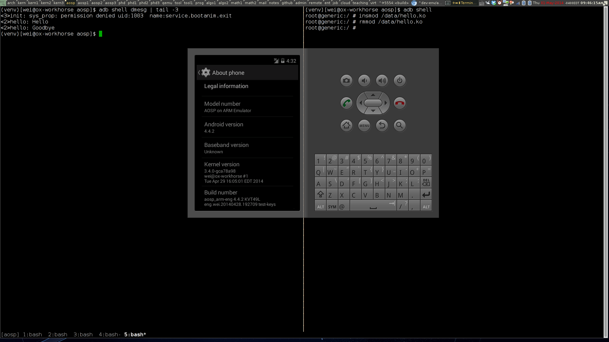

<!-- START doctoc generated TOC please keep comment here to allow auto update -->
<!-- DON'T EDIT THIS SECTION, INSTEAD RE-RUN doctoc TO UPDATE -->
**Table of Contents**  *generated with [DocToc](http://doctoc.herokuapp.com/)*

- [Linux kernel building/testing helper scripts](#linux-kernel-buildingtesting-helper-scripts)
	- [Cheatsheet](#cheatsheet)
		- [One-time setup](#one-time-setup)
		- [Build, install, and test the kernel](#build-install-and-test-the-kernel)
		- [Build, install, and test a kernel module](#build-install-and-test-a-kernel-module)

<!-- END doctoc generated TOC please keep comment here to allow auto update -->

# Android Open Source Project (AOSP) building/testing helper scripts

These scripts help set up AOSP building environment and, with the help of [Linux kernel hacking helper][linux-helper], build and test Android emulator (goldfish) kernel and loadable kernel modules (LKMs).

## Cheatsheet

### One-time setup

```bash
mkdir -p $HOME/hacking/aosp
cd $HOME/hacking/aosp
git clone https://github.com/pw4ever/aosp-hacking-helper.git helper
# cd into AOSP source top directory, say, $HOME/project/aosp
$HOME/hacking/aosp/helper/install-links.sh
```

If you want to use the scripts to build [Android emulator](https://developer.android.com/tools/help/emulator.html) kernel (goldfish), go and set up [Linux kernel hacking helper][linux-helper] at `$HOME/hacking/linux-kernel/helper` (follow [here](https://github.com/pw4ever/linux-kernel-hacking-helper#one-time-setup) for setup instructions).

### AOSP building routine

Every time, before you start [building AOSP](https://source.android.com/source/building-running.html), follow the following routine at the top-level directory of your [downloaded AOSP source](https://source.android.com/source/downloading.html).

```bash
# suppose we are at top-level AOSP directory now
bash
source 00routine.sh
lunch aosp_arm-eng # or other lunch combo (tip: use `print_lunch_combo` to see the menu; ${TARGET_PRODUCT}-${TARGET_BUILD_VARIANT}) of your choice
```

For your convenience, `source 00routine.sh` will print out this instruction (and the instructions for building goldfish kernel and LKMs).

### Build goldfish kernel

To build goldfish kernel, you must download it first (as of May 2014, Android kernel source requires *separate* download from the main AOSP source repo).

```bash
cd $(gettop)/99kernel/
git clone https://android.googlesource.com/kernel/goldfish.git goldfish
cd $(gettop)/99kernel/goldfish/
git checkout -t -b goldfish-3.4 origin/android-goldfish-3.4 # or other version of your choice

# initialize "linux kernel hacking helper" directories ($ARENA has been set up by "source 00routine.sh")
hack_init.sh 10 
```

Choose the target Kernel arch (ARM, x86_64, or i686) and kernel config you want to merge.

```bash
# build onto "linux kernel hacking helper" instance 1, on ARM arch, with 8 parallel jobs, and merging kernel configs for KGDB (kernel debugger) and LKM (loadable kernel module) support
$(gettop)/01build-goldfish-kernel.sh 1 arm 8 ${HOME}/hacking/linux-kernel/helper/config/kgdb ${HOME}/hacking/linux-kernel/helper/config/lkm

# build onto "linux kernel hacking helper" instance 2, on X86_64 arch, with 8 parallel jobs, and merging kernel configs for KGDB (kernel debugger) and LKM (loadable kernel module) support
$(gettop)/01build-goldfish-kernel.sh 2 x86_64 8 ${HOME}/hacking/linux-kernel/helper/config/kgdb ${HOME}/hacking/linux-kernel/helper/config/lkm

# build onto "linux kernel hacking helper" instance 3, on i686 arch, with 8 parallel jobs, and merging kernel configs for KGDB (kernel debugger) and LKM (loadable kernel module) support
$(gettop)/01build-goldfish-kernel.sh 3 i686 8 ${HOME}/hacking/linux-kernel/helper/config/kgdb ${HOME}/hacking/linux-kernel/helper/config/lkm
```

### Build, install, and test a loadble kernel module

To build a LKM, `cd` into the directory (perhaps create a directory for your module under `$(gettop)/99kernel/modules/`, e.g., `$(gettop)/99kernel/modules/hello/`), which has your LKM source. The Makefile/Kbuild should have the usual `obj-m += ` variable definitions; read the good old [LDD3](http://www.makelinux.net/ldd3/) or [kernel documentation](https://github.com/torvalds/linux/blob/master/Documentation/kbuild/modules.txt) on this.

```bash
# build onto "linux kernel hacking helper" instance 1, on ARM arch, with 8 parallel jobs
$(gettop)/01build-goldfish-module.sh 1 arm 8
```

After this, you should have (suppose your kernel module has `obj-m := hello.o` in Makefile/Kbuild) `hello.ko` in your directory. Now you can push the kernel module onto your emulator instance:

```bash
adb -e push hello.ko /data/hello.ko
```

Then, you can test it with:
```bash
# load the module
adb shell insmod /data/hello.ko

# unload the module
adb shell rmmod hello
```

### Bonus

This is what the build environment (with a running emulator) looks like.



The "Kernel version" and "Build number" show that it is running on my own builds. Also, the `adb shell dmesg | tail -3` show that we have successfully loaded and unloaded a test module (loaded by the adb shell session on the right with `insmod /data/hello.ko; rmmod hello`). 

Consider using [my awesome config](https://github.com/pw4ever/awesome-wm-config) if you like the X Window manager.

[linux-helper]: https://github.com/pw4ever/linux-kernel-hacking-helper "Linux kernel hacking helper"
